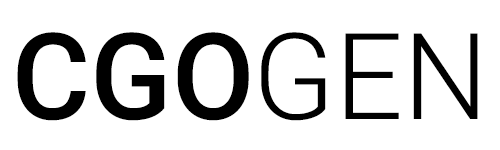

<a href="https://for-go.com"></a>
## Automatic C Bindings Generator for Go Programming Language

See [for-go.com](https://for-go.com) and the [documentation](https://github.com/xlab/c-for-go/wiki).

The [list of projects](https://github.com/xlab/cgogen/wiki/Examples) that used cgogen to generate bindings.

#### Installation

```
$ go get github.com/xlab/c-for-go
```

#### Credits

* [Jan Mercl](https://github.com/cznic) for his [cznic/cc](https://github.com/cznic/cc) C99 compiler front end package.

#### License

MIT
