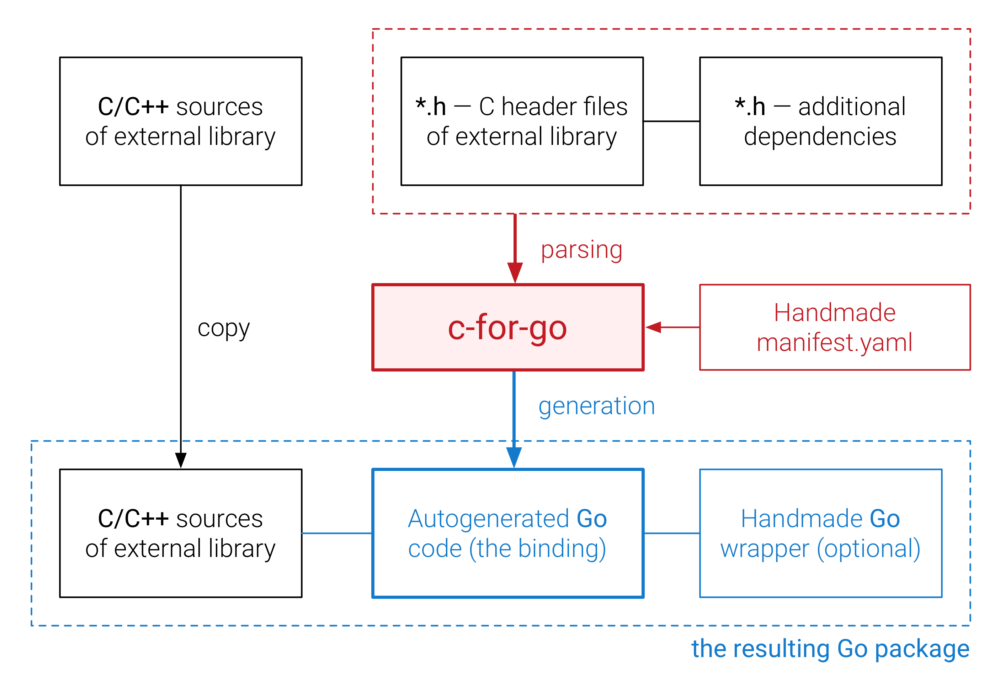

# c-for-go [](https://goreportcard.com/report/github.com/xlab/c-for-go)
_Automatic C-Go Bindings Generator for Go Programming Language_

This project allows to reuse existing C/C++ libraries in your Go applications, by automatically creating [c-go bindings](https://golang.org/cmd/cgo/) for a given set of C headers and the manifest file. We believe in component-based software engineering and think that reusing C/C++ code in Go applications could bring a huge boost to developer's productivity and system's performance. Read more about the motivation: [top reasons to use bindings](https://github.com/xlab/c-for-go/wiki/Top-5-reasons-to-use-bindings).

### Process overview

<p align="center">
    
</p>

The only component required to produce a Go package that will wrap the source C/C++ code is the YAML manifest file that defines parsing, translation and generation rules. The manifest can have just a few lines, however in order to match Go's naming conventions and provide enough tips for type conversions it usually contains about 100 lines, which is still better than producing tens of thousands lines of Go code by hand.

The resulting bindings are as low-level as C code, i.e. it would require knowledge of memory management to carefully use the resulting code, however no more C code is needed to make things done. Eventually some functions can be replaced manually with pure-Go analogs. Also usually a high-level wrapper is created by hand, to introduce Object Oriented Design into API, manage inner state and memory, thus making things safe and lifting the mental overhead.

A simple demo case can be seen on the project homepage http://sphere.software/c-for-go.

Full documentation is available at https://github.com/xlab/c-for-go/wiki

### Installation

```bash
$ go get github.com/xlab/c-for-go
```

A simple [Makefile template](https://github.com/xlab/c-for-go/wiki/Makefile-template).

### In action

* https://github.com/xlab/android-go 🌟
* https://github.com/vulkan-go/vulkan 🌟
* https://github.com/golang-ui/nuklear
* https://github.com/xlab/pocketsphinx-go
* https://github.com/xlab/libvpx-go
* https://github.com/xlab/portaudio-go
* https://github.com/xlab/portmidi
* https://github.com/xlab/alac-go
* https://github.com/xlab/vorbis-go
* https://github.com/xlab/opus-go
* https://github.com/xlab/libpd-go
* https://github.com/zenhotels/lmdb-go
* https://github.com/zenhotels/libpostal-go
* https://github.com/xlab/hamlib-go
* https://github.com/5k3105/nidaq
* https://github.com/SphereSoftware/pdf-go
* ...
* [Request yours](https://sphere.software/c-for-go/enterprise.html)

### Sponsors

<a href="https://sphereinc.com"></a>

### Credits

* [Jan Mercl](https://github.com/cznic) for his [cznic/cc](https://github.com/cznic/cc) C99 compiler front end package.

### License

MIT
